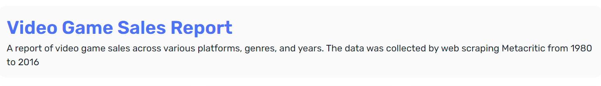
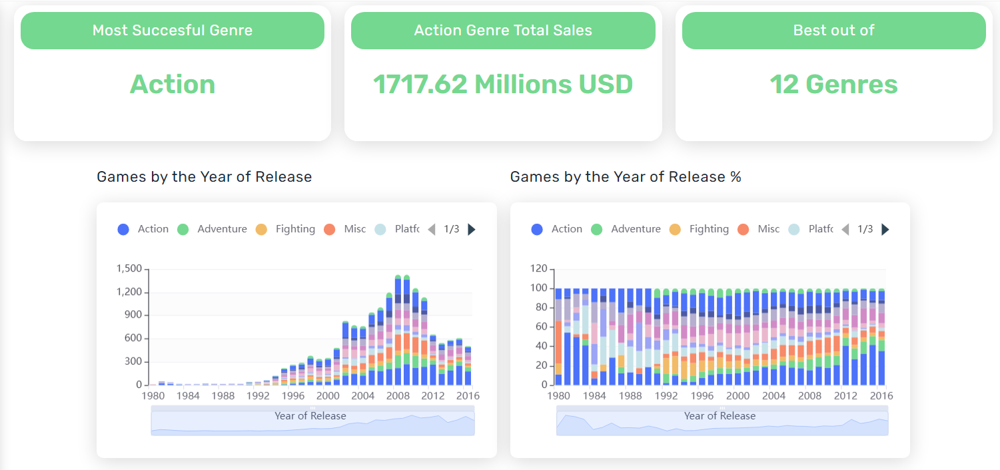
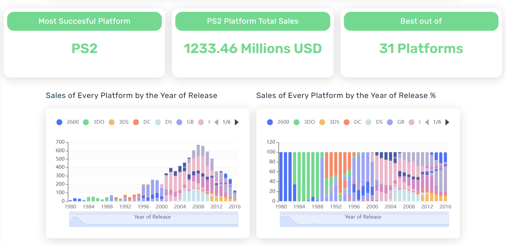
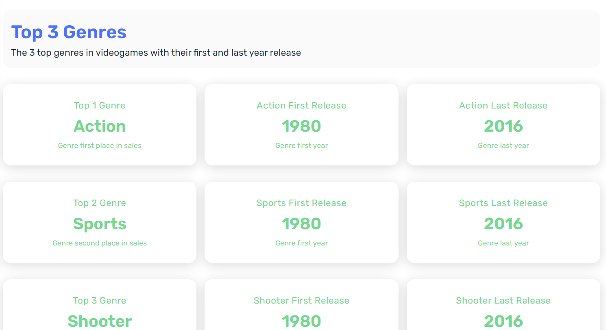

# Shimoku Data App - Video Game Sales Dashboard

## Overview

The Shimoku Data App is a comprehensive dashboard for analyzing video game sales data collected from 1980 to 2016. This dashboard provides insights into various aspects, including genres, years of release, and platforms.

## Features

- **Genre Analysis:** Explore the distribution of video game sales across different genres.
- **Yearly Trends:** Analyze the trends in video game releases and sales over the years.
- **Platform Performance:** Understand the sales performance of various gaming platforms.

## Screenshots

### Screenshot 1

### Screenshot 2

### Screenshot 3

### Screenshot 3

## Getting Started

1. **Installation:**
   - Clone the repository: `git clone `
   - Install dependencies: `pip install -r requirements.txt`

2. **Usage:**
   - Connect to Shimoku API using your account
   - Create a .env file with the data from the .env.example
   - Run the command pip install -r requirements.txt
   - Run the Shimoku Data App: `python main.py`

4. **Customization:**
   - Adjust data sources and configurations in the app script.
   - Modify visualizations and layouts based on your preferences.

## Dependencies

- Python 3.x
- Shimoku API
- Pandas
- Specified in `requirements.txt`

## Acknowledgments

- Data sourced from Metacritic through web scraping found in Kaggle.
- Shimoku API used for creating interactive dashboards.
